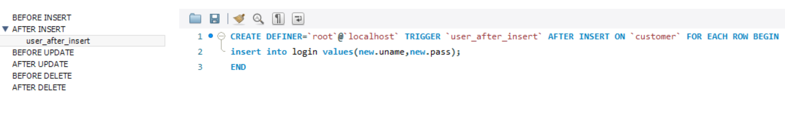
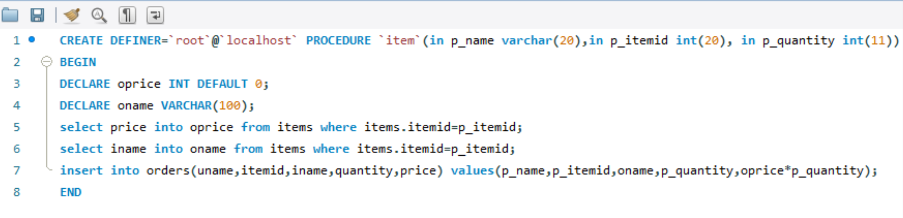

# Deparmental-store-management-system
A DBMS project where customers can place their orders by selecting required items, delete and view their order and total price.

Steps to run the project:
* Create a database on my sql workbench.
* Create tables and columns with same names as in the code.
* Insert the values for those tables.
* Create a trigger and stored procedures 

